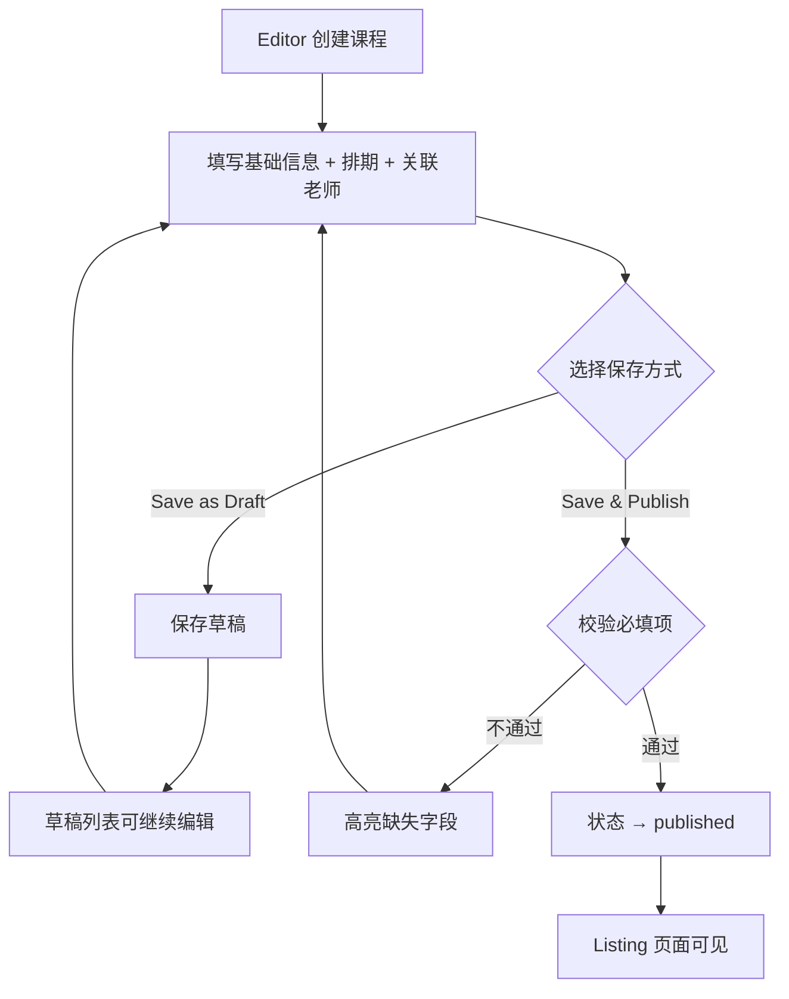

# 流程图 & 技术基础速览

> 日期：2026-07-06 | Phase 2 收尾 + Phase 3 前置

---

## 一、用 AI 生成流程图

### 为什么 BA 需要流程图

- **流程图**：梳理业务流程，确保所有人对流程有统一认知
- **时序图**：梳理系统交互，理清模块间谁调谁、谁等谁

### AI 时代怎么做

用 Mermaid 格式——纯文本图表语言，AI 写好直接渲染成图。

#### Prompt 模板

```
用 mermaid flowchart 画出以下流程：
- [步骤1]
- [步骤2]
- [分支判断]
- [结果]
```

#### 实战：课程发布流程



---

## 二、技术基础速览（BA 视角类比）

### HTML = 需求文档的结构

| 需求文档 | HTML |
|---------|------|
| 标题 | `<h1>` |
| 段落 | `<p>` |
| 表格 | `<table>` |
| 按钮 | `<button>` |
| 输入框 | `<input>` |

**HTML 只管骨架**——页面上有什么内容。

### CSS = 公司 PPT 模板

| PPT 模板 | CSS |
|---------|-----|
| 统一字体 | `font-family` |
| 统一配色 | `color` / `background` |
| 统一间距 | `padding` / `margin` |

**CSS 只管外观**——换一套 CSS，同一份 HTML 可以完全不同。

### JavaScript = 审批流自动规则

| 审批规则          | JavaScript                     |
| ------------- | ------------------------------ |
| "金额>5000须总监批" | `if (amount > 5000) { ... }`   |
| "通过后自动发通知"    | `save() + toast('成功')`         |
| "驳回须填原因"      | `if (!reason) { showError() }` |

**JS 只管行为**——点击按钮发生什么、数据怎么校验。

### JSON = Excel 表格转纯文本

```json
{
  "course_id": "C001",
  "title": "Python课",
  "price": 3000
}
```

**JSON 是系统间传数据的通用格式**。

### localStorage = 浏览器里的小型 Excel

```javascript
localStorage.setItem("courses", JSON字符串)   // Ctrl+S 保存
JSON.parse(localStorage.getItem("courses"))   // 双击打开
```

数据存在浏览器里，关掉页面还在。缺点：只在这台电脑的这个浏览器里有。

### 代码对应关系（以 course-management.html 为例）

| 你看到的 | 技术 | 代码位置 |
|---------|------|---------|
| 页面结构 | HTML | `<div class="header">`, `<table>` |
| 颜色/圆角/阴影 | CSS | `<style>` 标签内 |
| 按钮点击/搜索/保存 | JS | `<script>` 标签内 |
| 课程数据 | JSON | `courses` 数组, `getDefaultCourses()` |
| 数据持久化 | localStorage | `load()` / `save()` 函数 |

---

## 学习要点

1. **HTML/CSS/JS 三者分工明确**：骨架 / 外观 / 行为
2. **JSON 是你数据的语言**：所有模块间传数据都用它
3. **localStorage 是临时的**：学习阶段够用，生产环境要用后端数据库
4. **流程图用 Mermaid**：比 Visio 快，AI 直接生成
