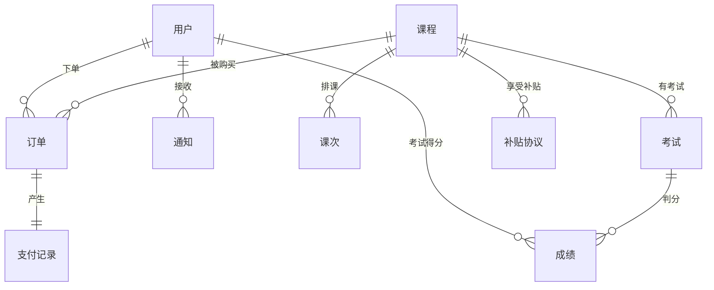

# ER 图与模块依赖分析

## ER 图（Entity-Relationship Diagram）

### 什么是 ER 图？
实体关系图——用图形化的方式画清楚"系统里有哪几类数据、它们之间怎么关联"。

### 业务对象 vs 系统对象

| | 业务对象 | 系统对象 |
|---|---|---|
| **定义** | 真实世界存在的东西 | 为了让系统运转而存在的东西 |
| **例子** | 课程、用户、老师、订单 | 通知、日志、缓存、配置 |
| **谁关心** | 业务方、产品经理、BA | 开发人员、运维 |
| **变化频率** | 低（业务模型稳定） | 高（随技术需求变化） |

### 教育平台的 9 个数据实体

**业务对象：** 👤用户, 📚课程, 📋订单, 💰补贴协议, 💳支付记录
**系统对象：** 📬通知, 📝考试, 🎯成绩, 📅课次

### 实体关系（ER 图）



> `||--o{` 表示"一对多"关系。竖线=一，圆圈=零或多。

## JS 模块依赖分析

### 加载顺序 = 依赖层级

```
Layer 4 - 入口：app.js
          (依赖所有下层模块)
                ↓
Layer 3 - 页面：home, login, dashboard, courses, orders,
                payment, funding, exam, sessions, myCourses,
                messages, admin
          (依赖 store / auth / fundingEngine)
                ↓
Layer 2 - 业务：auth.js, router.js, fundingEngine.js
          (依赖 store)
                ↓
Layer 1 - 基础：store.js, seed.js, eventBus.js, utils.js
          (不依赖任何模块)
```

### 变更影响规则

| 改哪层 | 影响范围 | 风险 |
|--------|---------|------|
| Layer 1（store.js） | 所有页面 + 所有业务逻辑 | 🔴 高 |
| Layer 2（auth.js） | 所有需要登录的页面 | 🟡 中 |
| Layer 3（某个 page） | 仅该页面 | 🟢 低 |
| Layer 4（app.js） | 全局 UI 框架 | 🟡 中 |

## CRUD 矩阵

一张表看清"哪些页面在操作哪些数据"：

| 实体 | 🔍 读取 | ✏️ 创建 | 📝 修改 | 🗑️ 删除 |
|------|---------|---------|---------|---------|
| users | home, dashboard, courses | *(种子数据)* | — | — |
| courses | home, dashboard, myCourses, funding, sessions, orders | **courses.js** | **courses.js**, funding.js | courses.js |
| orders | home, dashboard, myCourses, orders, payment | **home.js** | **orders.js**, **payment.js** | — |
| funding | home(价格计算), dashboard | **funding.js** | funding.js | — |
| payments | orders(关联查看) | **payment.js** | — | — |
| sessions | dashboard, sessions, myCourses | **sessions.js** | — | — |
| exams | exam, dashboard, myCourses | *(种子数据)* | — | — |
| scores | dashboard, exam, myCourses | **exam.js** | — | — |
| notifications | app, messages, dashboard | payment.js(自动) | **messages.js** | messages.js |

## 变更影响分析模板

动代码前先填一遍，养成习惯：

```
▸ 我要改什么？
  文件：________
  函数/数据：________

▸ 谁在用这个文件？
  （看依赖层级，所有在它之后加载的文件都可能是依赖方）

▸ 谁在读/写这个数据？
  （查 CRUD 矩阵中该数据实体所在的行）

▸ 改完要验证什么？
  1. 手动点：________
  2. 跑测试：npx playwright test
```

### 典型场景举例

**场景：改 courses.js 的价格计算逻辑**

- 依赖方：home.js（课程详情页展示价格）、funding.js（补贴金额叠加）、orders.js（订单金额）
- CRUD 影响：courses 表的 price 字段读取
- 验证：点一遍"课程市场→课程详情→下单→支付"的完整链路
